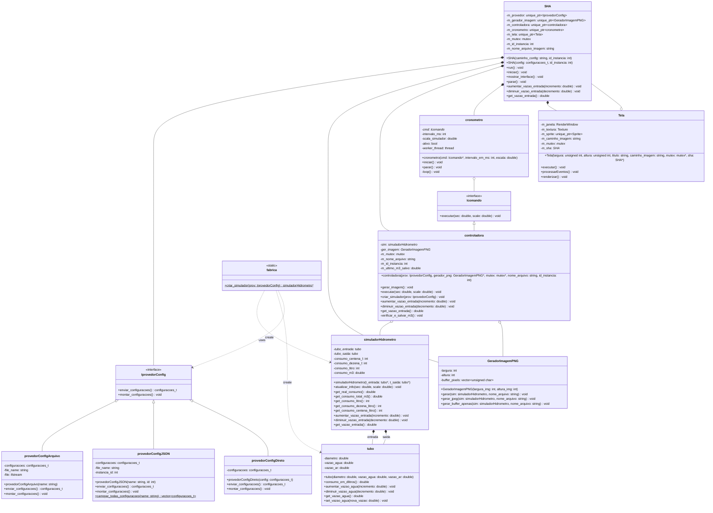

## Simulador de Hidrômetro


Projeto para a disciplina de Padrões de Projeto do curso de Engenharia de Computação do IFPB Campus Campina Grande.

O projeto simula um hidrômetro, desenvolvido em C++, onde simula o consumo de água tentando se aproximar da realidade. O usuário pode realizar a configuração do simulador para tentar se aproximar de uma situação desejada. Além de gerar mais de uma instância de SHA independente ao mesmo tempo, executando-os simultâneamente.

## Arquitetura do Sistema



## Como Executar o Projeto

### Pré-requisitos

Certifique-se de ter instalado:
- **Compilador C++17 ou superior** (g++)
- **SFML 2.5+** (Simple and Fast Multimedia Library)
- **Make** (para utilizar o Makefile)

#### Instalação do SFML no Ubuntu/Debian:
```bash
sudo apt update
sudo apt install libsfml-dev
```

#### Instalação do SFML no Arch Linux:
```bash
sudo pacman -S sfml
```

### Compilação

O projeto utiliza um Makefile completo com várias opções de compilação:

#### Comandos Principais:

```bash
# Compilação padrão
make all
# ou simplesmente
make

# Limpeza de arquivos temporários
make clean

# Limpeza e recompilação completa
make rebuild

# Compilação e execução
make run

# Compilação para debug (com símbolos de depuração)
make debug

# Compilação otimizada para release
make release

# Teste de compilação (compila mas não executa)
make test-build
```

#### Comandos Utilitários:

```bash
# Verificar dependências
make check-deps

# Informações sobre o projeto
make info

# Mostrar ajuda
make help
```

### Configuração

O simulador utiliza um arquivo `config.json` para configurar múltiplas instâncias:

```json
{
  "instancias": [
    {
      "id": 1,
      "nome": "Hidrometro_Principal",
      "vazao_entrada": 2.0,
      "diametro_entrada": 0.075,
      "ar_entrada": 1.5,
      "vazao_saida": 2.0,
      "diametro_saida": 0.075,
      "ar_saida": 0.0,
      "tempo": 1000,
      "scale": 10
    }
  ]
}
```

### Execução

Após a compilação, execute:

```bash
./simulador_hidrometro
```

O programa irá:
1. Carregar as configurações do `config.json`
2. Criar múltiplas instâncias de hidrômetros simultaneamente
3. Abrir janelas gráficas para cada instância
4. Salvar automaticamente imagens JPEG a cada m³ consumido

### Controles

Durante a execução, você pode:
- **Seta para cima (↑)** ou **+**: Aumentar vazão de entrada
- **Seta para baixo (↓)** ou **-**: Diminuir vazão de entrada
- **Fechar janela**: Encerrar a instância específica

### Estrutura de Arquivos

```
projeto/
├── main.cpp              # Ponto de entrada do programa
├── config.json           # Configurações das instâncias
├── Makefile              # Sistema de compilação
├── src/                  # Código fonte
│   ├── SHA.cpp/hpp       # Classe principal do simulador
│   ├── simuladorHidrometro.cpp/hpp
│   ├── IprovedorConfig.cpp/hpp
│   ├── GeradorImagemPNG.cpp/hpp
│   ├── cronometro.cpp/hpp
│   ├── tela.cpp/hpp
│   ├── tubo.cpp/hpp
│   ├── fabrica.cpp/hpp
│   └── Icomando.cpp/hpp
├── outputs/              # Arquivos objeto (gerados)
├── temp/                 # Arquivos PNG temporários
└── Medições_*/           # Imagens JPEG salvas automaticamente
```